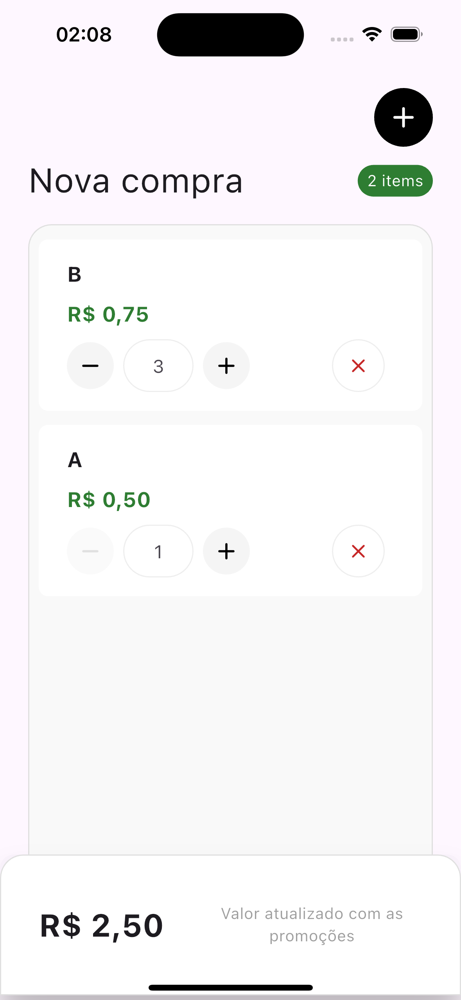

# test_2go_bank

Projeto Flutter (versão: 3.24.3-stable).

## Getting Started

O aplicativo possui apenas uma tela básica, onde é listado os produtos para compra, e exibido o valor total.
Existem também um bottom sheet somente para adicionar produto na lista.

  
  

**[Get It]** -> Usado para a injeção de dependências;

**[MobX]** -> Gerenciamento de estado;

### Adicionar Produto

Para adicionar um produto é preciso digitar o seu código e clicar no botão Adicionar.
Códigos inválidos retornarão uma resposta de erro: "Produto não encontrado!".

Um dos pontos iniciais deste projeto foi entender como poderiam estar estruturado os dados. O resultado é o conjunto de tabelas logo abaixo, populadas com os preços da semana informados no teste.

No arquivo ***lib/data/data_sources/remote_data_source.dart***, existem as listas *mockedProducts* e *mockedPromotions*, que são usadas como a base de dados do sistema (exatamente como preenchido na imagem acima). Para modificar o preço dos produtos, adicionar novos produtos, adicionar novas promoções, entre outros.. basta alterá-las.

### Lógica do Sistema

Segue abaixo um diagrama de sequência que mostra o fluxo dos dados dentro do sistema.

Para calcular o valor total do carrinho de compras, os produtos foram separados entre os que possuiam promoções e os que não possuiam.

1. Produtos com promoções são analisados primeiro, passando em item por item e verificando se as condições são atendidas.
2. Caso esteja válida, é somado o valor do produto com a promoção e removido a quantidade usada da lista. O processo repete até que não atenda mais a promoção.
3. Depois de passar por todos os produtos promocionais e removido o amount usado, restam apenas os produtos para uma soma simples (quantidade * preço_base).

**Detalhe:** Como não foi especificado no Teste, precisei definir algumas regras para seguir com a lógica:

1. Um produto não pode estar em mais de uma promoção;
2. Ofertas combinadas não são preenchidas em ambos os produtos. Esta é um regra adicionada diretamente na *base de dados*, foi uma solução mais simples e rápida para evitar duplicações.

## Melhorias

O projeto foi pensado para um possível abastecimento remoto. A ideia original seria trabalhar com cache e local database, alternando entre os data sources e realizando sincronizações estratégicas. Para uma quantidade pequena de amostra não faria diferença, mas começaria a trazer benefícios de performance a medida que as tabelas Product e Promotion crescessem. Infelizmente, não tive tempo suficiente para trabalhar em cima disto no teste.

A utilização do [MobX] foi apenas pensando na velocidade de desenvolvimento, já que é um gerenciamento fresco na minha cabeça por estar trabalhando com ele em outro projeto. Mas, se tivesse maior tempo, provavelmente trabalharia com bloc/cubit ou riverpod. Porque embora seja simples, o [MobX] te dá muita liberdade de código e isso atrapalha principalmente projetos grandes, que começam a ficar confusos e sem padrão.